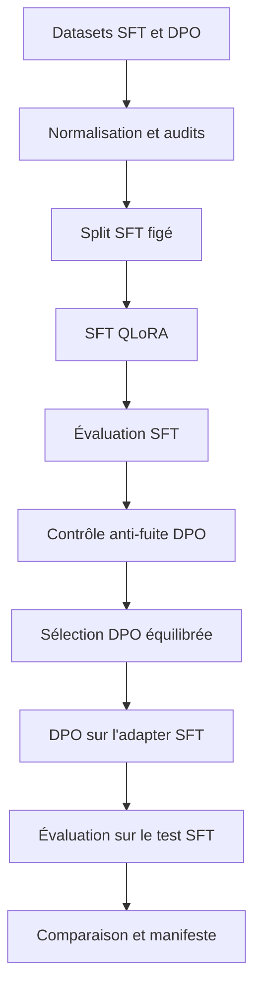

# Dossier technique — Fine-tuning SFT et DPO du modèle de triage médical

## Statut du document

| Élément | Valeur |
|---|---|
| Projet | Agent de triage médical P1 / P2 / P3 |
| Modèle de base | `Qwen/Qwen3-1.7B-Base` |
| Méthodes | SFT avec QLoRA, puis DPO avec PEFT |
| Source documentaire | Code et sorties du notebook `03_finetuning_sft_dpo(4).html` |
| Périmètre | Préparation des données, entraînement, évaluation et traçabilité |
| Positionnement | Prototype pédagogique, non utilisable pour une décision clinique réelle |

## 1. Objectif du notebook

Dans ce notebook, je construis une expérience complète de fine-tuning pour classer une situation médicale selon trois niveaux de priorité :

- **P1** : urgence élevée nécessitant une prise en charge rapide ;
- **P2** : urgence modérée ;
- **P3** : situation différable.

Ma méthode comporte deux étapes successives :

1. un **Supervised Fine-Tuning (SFT)** pour apprendre la tâche de classification et le format de réponse attendu ;
2. un **Direct Preference Optimization (DPO)** pour apprendre à préférer une réponse médicale de meilleure qualité sans modifier la priorité validée.

Je compare ensuite le modèle SFT et le modèle DPO sur les **504 mêmes exemples de test**. Ce choix est essentiel : une amélioration ne peut être attribuée au DPO que si les deux modèles sont évalués dans des conditions identiques.

Le notebook met également en place des contrôles d’intégrité, des splits reproductibles, une prévention des fuites de données, un suivi Weights & Biases et un manifeste expérimental.

## 2. Vue d’ensemble de ma méthode



Les données compactes servent à l’entraînement. Les versions riches servent uniquement aux audits, à la validation de provenance et à la traçabilité.

## 3. Environnement logiciel

Le notebook vérifie les versions avant de charger le modèle. Je bloque ainsi l’expérience si l’API installée ne correspond pas à celle utilisée par le code.

| Bibliothèque | Version observée | Contrainte du notebook | Rôle |
|---|---:|---:|---|
| PyTorch | `2.13.0+cu130` | `>=2.10,<3` | Calcul tensoriel et CUDA |
| Transformers | `5.16.1` | `>=5,<6` | Modèle, tokenizer et entraînement |
| TRL | `1.13.0` | `==1.13.0` | `SFTTrainer` et `DPOTrainer` |
| PEFT | `0.19.1` | `>=0.18,<0.20` | Adapters LoRA |
| Accelerate | `1.14.0` | `>=1.10,<2` | Exécution de l’entraînement |
| bitsandbytes | `0.49.2` | `>=0.48,<0.50` | Quantification et optimiseur 8 bits |
| Datasets | `4.8.5` | `>=4.4,<5` | Construction des datasets TRL |
| W&B | `0.23.1` | `>=0.22,<0.24` | Suivi des expériences |

L’exécution visible utilise une **NVIDIA GeForce RTX 4050 Laptop de 6 Go**, CUDA 13.0 et BF16. Cette contrainte matérielle explique les choix QLoRA, batch unitaire, accumulation de gradients et optimisation mémoire.

## 4. Organisation reproductible de l’expérience

Je centralise tous les paramètres dans une dataclass immuable `ExperimentConfig`. Cette organisation évite les valeurs dispersées dans le notebook et permet d’enregistrer la configuration complète dans W&B et dans le manifeste final.

J’utilise une seed unique de `42` pour :

- `transformers.set_seed` ;
- le module Python `random` ;
- NumPy ;
- les splits scikit-learn ;
- le mélange préalable à la sélection DPO ;
- `seed` et `data_seed` des trainers.

Ce choix ne rend pas automatiquement tous les calculs CUDA parfaitement déterministes, mais il stabilise les principales opérations aléatoires du pipeline.

Chaque exécution reçoit un horodatage UTC. Les splits, métriques, checkpoints et adapters sont stockés sous un répertoire propre au run :

```text
artifacts/finetuning_sft_dpo/
├── splits/<run_stamp>/
├── metrics/<run_stamp>/
└── models/<run_stamp>/
    ├── sft_checkpoints/
    ├── sft_adapter/
    ├── dpo_checkpoints/
    └── dpo_adapter/
```

## 5. Choix du modèle de base

### 5.1 Modèle retenu

J’utilise `Qwen/Qwen3-1.7B-Base`, révision `main`.

Le code permet d’établir les raisons opérationnelles suivantes :

- il s’agit d’un modèle causal compatible avec `AutoModelForCausalLM` ;
- il possède un chat template utilisé de façon identique au SFT, au DPO et à l’évaluation ;
- sa taille de 1,7 milliard de paramètres reste exploitable sur une carte de 6 Go avec une quantification 4 bits ;
- sa base peut être adaptée à la tâche sans entraîner tous ses paramètres grâce à LoRA ;
- un tokenizer unique est utilisé du début à la fin, ce qui évite une incompatibilité entre modèle, SFT et DPO.

Le notebook ne contient cependant **aucun benchmark comparatif entre plusieurs modèles de base**. Je peux donc justifier Qwen3‑1.7B par sa compatibilité technique et son adéquation avec les ressources locales, mais pas affirmer à partir de ce seul code qu’il est meilleur qu’un autre modèle.

### 5.2 Modèle Base plutôt qu’Instruct

Le modèle sélectionné est explicitement une version `Base`. Dans ma méthode, c’est le SFT qui lui apprend :

- la consigne de triage ;
- l’échelle P1/P2/P3 ;
- le respect du format `PRIORITY: Px` ;
- l’utilisation du contexte clinique bilingue.

Ce choix me permet de construire le comportement attendu à partir de mes propres exemples. En contrepartie, il rend la qualité du dataset SFT particulièrement importante.

### 5.3 Sécurité du chargement

Je fixe `trust_remote_code=False`. Je limite ainsi l’exécution de code personnalisé provenant du dépôt du modèle. La révision `main` n’est toutefois pas une révision immuable : pour une reproductibilité plus forte, je devrais remplacer `main` par un hash de commit précis.

## 6. Données utilisées

Quatre fichiers sont chargés :

| Fichier logique | Volume | Colonnes | Usage |
|---|---:|---:|---|
| SFT compact | 5 034 | 7 | Entraînement et évaluation SFT |
| SFT riche | 9 079 | 86 | Audit et provenance |
| DPO compact | 3 675 | 7 | Pool de sélection DPO |
| DPO riche | 7 208 | 16 | Audit et validation DPO |

Le SFT compact contient : `id`, `language`, `source_split`, `question`, `context`, `answer`, `priority`.

Le DPO compact contient : `id`, `language`, `source_split`, `prompt`, `chosen`, `rejected`, `priority`.

Je normalise :

- les identifiants en chaînes de caractères ;
- les langues en minuscules sans espaces ;
- les priorités en entiers limités à `{1, 2, 3}` ;
- les textes absents en chaînes vides ;
- les variantes de schéma en un contrat plat commun.

## 7. Audits avant entraînement

La fonction `audit` bloque l’expérience si :

- une colonne obligatoire manque ;
- un identifiant est absent ou dupliqué ;
- la langue n’est ni `fr` ni `en` ;
- la priorité n’est pas P1, P2 ou P3 ;
- un texte obligatoire est vide.

Je vérifie en plus que `chosen` et `rejected` sont différents pour toutes les paires DPO.

### 7.1 Équilibre des priorités

| Dataset | P1 | P2 | P3 | Total |
|---|---:|---:|---:|---:|
| SFT | 1 678 | 1 678 | 1 678 | 5 034 |
| Pool DPO | 1 225 | 1 225 | 1 225 | 3 675 |

J’impose un équilibre strict au SFT, avec une tolérance maximale de 2 %. Ici, les trois classes sont exactement équilibrées. Ce choix évite qu’une classe majoritaire domine mécaniquement l’apprentissage et rend le macro-F1 particulièrement pertinent.

### 7.2 Répartition linguistique

| Dataset | Français | Anglais |
|---|---:|---:|
| SFT | 2 434 | 2 600 |
| DPO | 0 | 3 675 |

Le SFT est bilingue et relativement équilibré. Le DPO est en revanche entièrement anglophone. Ce n’est pas un détail : le DPO peut modifier le comportement global du modèle sans fournir de préférence française. Je conserve donc l’évaluation séparée par langue pour le SFT et je considère l’absence de français dans le DPO comme une limite méthodologique.

## 8. Construction des exemples SFT

Je construis chaque exemple en deux parties :

```text
prompt = [message système, message utilisateur]
completion = [message assistant]
```

Le message système définit la tâche, explique P1/P2/P3, interdit d’inventer des informations absentes et impose une sortie exacte. Il existe en français et en anglais.

Le message utilisateur réunit, lorsque les champs sont disponibles :

- le contexte ;
- la question ;
- l’information médicale issue du champ `answer`.

La cible assistant est uniquement :

```text
PRIORITY: P1
```

ou P2/P3 selon le label.

Le champ `answer` présent dans l’entrée n’est donc pas la cible de classification. Il est traité comme une information médicale supplémentaire. La priorité attendue n’est pas injectée dans le prompt.

## 9. Tokenizer et chat template

J’utilise le tokenizer du même dépôt que le modèle. Je choisis un padding à gauche, adapté à l’inférence causale lorsque les longueurs de prompts diffèrent. Si aucun token de padding n’est défini, je réutilise le token EOS.

J’applique le chat template Qwen avec :

- `add_generation_prompt=True` pendant le scoring ou la préparation du prompt DPO ;
- `enable_thinking=False` afin de produire une classification courte et directe ;
- `add_special_tokens=False` lors de la tokenisation d’un texte déjà rendu par le chat template, afin de ne pas dupliquer les tokens spéciaux.

Un fallback retire `enable_thinking` si la version du tokenizer ne prend pas cet argument en charge.

## 10. Split SFT

Je crée des splits stratifiés sur la combinaison `langue × priorité`.

| Split | Total | P1 | P2 | P3 | Français | Anglais |
|---|---:|---:|---:|---:|---:|---:|
| Train | 4 026 | 1 342 | 1 342 | 1 342 | 1 946 | 2 080 |
| Validation | 504 | 168 | 168 | 168 | 244 | 260 |
| Test | 504 | 168 | 168 | 168 | 244 | 260 |

Le code réserve exactement 1 008 exemples, puis partage ce groupe en 504 exemples de validation et 504 exemples de test. Les proportions obtenues sont donc proches de 80/10/10.

Je sauvegarde uniquement les identifiants des splits. Si les trois fichiers existent, je les recharge ; si un seul manque, je bloque le pipeline. Cette règle évite de recréer silencieusement un test différent entre deux exécutions.

Je vérifie ensuite :

- l’absence d’intersection entre train, validation et test ;
- la couverture exacte de tous les identifiants sources ;
- les volumes attendus ;
- la validité de toutes les complétions.

## 11. Choix de la longueur SFT

Je fixe `sft_max_length=1024`.

Sur les 4 530 exemples de train et validation :

- 4 422 tiennent dans la limite ;
- 108 la dépassent ;
- la couverture est de **97,62 %** ;
- 2,38 % des séquences sont donc tronquées.

Cette longueur est un compromis entre conservation de l’information clinique et consommation de VRAM. Le code conserve la fin du prompt lors du scoring conditionnel, ce qui protège la partie la plus proche de la cible. Pour l’entraînement TRL, la troncature est gérée par le trainer.

## 12. Quantification QLoRA

J’utilise une quantification 4 bits avec la configuration suivante :

| Paramètre | Valeur | Justification |
|---|---|---|
| `load_in_4bit` | `True` | Réduit fortement la mémoire nécessaire au modèle de base |
| `bnb_4bit_quant_type` | `nf4` | Format 4 bits adapté aux poids de réseaux neuronaux |
| `bnb_4bit_use_double_quant` | `True` | Compresse aussi les constantes de quantification |
| `bnb_4bit_compute_dtype` | BF16 sinon FP16 | Conserve les calculs dans un format flottant efficace sur GPU |
| `device_map` | `{"": 0}` | Place le modèle sur le GPU 0 |
| `attn_implementation` | `sdpa` | Utilise l’implémentation PyTorch de l’attention efficace |

Le code exige explicitement CUDA. Le notebook ne prévoit pas d’entraînement QLoRA CPU.

BF16 est sélectionné lorsque le GPU le supporte ; sinon le code bascule sur FP16. L’exécution observée utilise BF16. Ce choix offre une plage dynamique supérieure à FP16 et réduit le risque de sous-flux numérique.

## 13. Configuration LoRA

Je n’entraîne pas les 1,7 milliard de paramètres. J’ajoute des matrices LoRA aux projections principales du modèle.

| Paramètre | Valeur | Justification technique |
|---|---:|---|
| `r` | 16 | Capacité d’adaptation intermédiaire sans coût mémoire excessif |
| `lora_alpha` | 32 | Mise à l’échelle égale à `alpha/r = 2` |
| `lora_dropout` | 0,05 | Régularisation légère des branches LoRA |
| `bias` | `none` | N’entraîne pas les biais et limite le nombre de paramètres |
| `task_type` | `CAUSAL_LM` | Correspond à Qwen chargé comme modèle causal |

Les modules ciblés sont :

| Famille | Modules |
|---|---|
| Attention | `q_proj`, `k_proj`, `v_proj`, `o_proj` |
| MLP | `gate_proj`, `up_proj`, `down_proj` |

Je couvre donc les projections d’attention et les couches feed-forward. C’est une adaptation plus large que le seul couple Q/V, tout en restant beaucoup plus légère qu’un fine-tuning complet.

Lors du DPO, le notebook affiche **17 432 576 paramètres entraînables sur 1 755 440 128**, soit **0,9931 %**. Ce résultat confirme que l’approche PEFT respecte l’objectif de réduction du coût d’entraînement.

Le code ne contient toutefois pas d’étude d’ablation sur `r`, `alpha`, le dropout ou la liste des modules. Ces valeurs constituent une configuration raisonnée, mais pas un optimum démontré expérimentalement dans ce notebook.

## 14. Paramètres TRL du SFT

| Paramètre | Valeur | Mon choix et sa justification |
|---|---:|---|
| `num_train_epochs` | 3 | Donne plusieurs passages sur un dataset de taille limitée |
| `learning_rate` | `2e-4` | Taux adapté à l’entraînement d’adapters LoRA, pas du modèle complet |
| `per_device_train_batch_size` | 1 | Nécessaire pour tenir dans 6 Go de VRAM |
| `per_device_eval_batch_size` | 1 | Même contrainte mémoire pendant l’évaluation |
| `gradient_accumulation_steps` | 8 | Produit un batch effectif de 8 exemples |
| `gradient_checkpointing` | `True` | Réduit la mémoire d’activation au prix de calculs supplémentaires |
| `use_reentrant` | `False` | Utilise le mode moderne compatible avec la pile PyTorch employée |
| `bf16` / `fp16` | Automatique | BF16 si supporté, sinon FP16 |
| `optim` | `paged_adamw_8bit` | Réduit la mémoire de l’optimiseur |
| `lr_scheduler_type` | `cosine` | Diminue progressivement le taux d’apprentissage |
| `max_grad_norm` | 1,0 | Limite les gradients extrêmes |
| `max_length` | 1 024 | Couvre 97,62 % des séquences auditées |
| `completion_only_loss` | `True` | Calcule la loss uniquement sur la réponse assistant |
| `eval_strategy` | `steps` | Évalue régulièrement pendant l’entraînement |
| `save_strategy` | `steps` | Sauvegarde aux mêmes intervalles |
| `eval_steps` | 100 | Suit suffisamment tôt l’évolution de la validation |
| `save_steps` | 100 | Aligne les checkpoints sur les évaluations |
| `logging_steps` | 10 | Offre un suivi plus fin sans sauvegarder à chaque log |
| `load_best_model_at_end` | `True` | Recharge le checkpoint ayant la meilleure `eval_loss` |
| `metric_for_best_model` | `eval_loss` | Sélectionne le meilleur modèle sur les données non entraînées |
| `greater_is_better` | `False` | Une loss plus faible est préférable |
| `save_total_limit` | 2 | Limite l’espace disque occupé par les checkpoints |
| `dataset_num_proc` | 1 | Évite la complexité du multiprocessing sur la machine locale |
| early stopping | patience 3 | Arrête après trois évaluations sans amélioration |

### 14.1 Loss limitée à la complétion

Je choisis `completion_only_loss=True`. Le modèle n’est donc pas entraîné à recopier le système ou l’entrée médicale ; seuls les tokens de la réponse assistant participent à la loss.

Le notebook le vérifie sur un batch réel :

- 431 tokens au total ;
- 420 tokens ignorés avec le label `-100` ;
- 11 tokens supervisés ;
- cible décodée : `<think>\n\n</think>\n\nPRIORITY: P1`.

Cette vérification est importante, car elle confirme que le masquage est réellement appliqué par le trainer et pas seulement demandé dans la configuration.

### 14.2 Résultat de l’entraînement SFT

L’entraînement visible s’arrête à l’étape 1 300, à l’époque `2,642766`. Il n’atteint donc pas les trois époques maximales, ce qui est cohérent avec l’early stopping.

| Mesure | Valeur |
|---|---:|
| Durée d’entraînement | 7 921 s, soit environ 2 h 12 |
| Débit | 1,49 exemple/s |
| Loss moyenne d’entraînement | 2,202842 |
| Meilleure loss de validation rechargée | 2,181174 |
| Accuracy moyenne par token | 0,698255 |

La loss de validation baisse globalement de 2,214453 à un meilleur niveau de 2,181174, puis ne progresse plus assez. Le mécanisme d’arrêt anticipé évite de poursuivre inutilement.

## 15. Évaluation du SFT

### 15.1 Scoring conditionnel des trois classes

Je ne demande pas au modèle de générer librement une réponse longue. Pour chaque exemple, je calcule séparément la log-probabilité moyenne de :

- `PRIORITY: P1` ;
- `PRIORITY: P2` ;
- `PRIORITY: P3`.

Je sélectionne ensuite la classe ayant le meilleur score.

Ce choix présente plusieurs avantages :

- les trois sorties possibles sont contraintes ;
- aucune erreur de parsing n’est possible dans cette fonction ;
- la comparaison porte directement sur la préférence du modèle entre les classes ;
- les scores peuvent être conservés pour analyser l’incertitude relative.

La longueur maximale de génération configurée à 5 tokens n’est pas utilisée par cette méthode d’évaluation.

### 15.2 Métriques SFT

| Métrique | Résultat |
|---|---:|
| Accuracy | 0,6984 |
| Précision macro | 0,6986 |
| Rappel macro | 0,6984 |
| F1 macro | 0,6954 |
| F1 pondéré | 0,6954 |
| Accuracy anglais | 0,7423 |
| F1 macro anglais | 0,7386 |
| Accuracy français | 0,6516 |
| F1 macro français | 0,6499 |

L’écart entre anglais et français est important : environ 9 points d’accuracy. Le SFT est pourtant bilingue ; ce résultat montre que l’équilibre du volume ne suffit pas à garantir une performance linguistique équivalente.

### 15.3 Sous-triage SFT

| Erreur | Nombre | Taux sur la classe attendue |
|---|---:|---:|
| P1 → P2 | 27 | 16,07 % |
| P1 → P3 | 19 | 11,31 % |
| P2 → P3 | 44 | 26,19 % |

Dans un projet de triage, je ne me limite donc pas à l’accuracy. Je mesure explicitement les erreurs qui retardent la prise en charge.

## 16. Tests de robustesse et validation croisée

Le notebook prévoit quatre perturbations non cliniques :

- passage en minuscules ;
- modification des espaces ;
- modification de la ponctuation ;
- modification des retours à la ligne.

Pour chacune, je mesure la stabilité par rapport à la prédiction de référence, l’accuracy et le sous-triage. Le mécanisme reprend les perturbations manquantes après interruption. Les valeurs chiffrées du tableau de robustesse ne sont cependant pas présentes sous forme textuelle exploitable dans l’export fourni ; je ne les invente donc pas.

Une validation croisée exploratoire est aussi implémentée : trois folds, échantillon équilibré par langue et priorité, et limite de 135 étapes par fold. Elle est toutefois désactivée avec `cross_validation=False`. Elle ne contribue donc pas aux résultats finaux du notebook.

## 17. Préparation des données DPO

### 17.1 Objectif des paires

Le DPO n’est pas utilisé pour changer la priorité. Pour une même situation, `chosen` et `rejected` conservent la **même priorité validée**, mais diffèrent par la qualité de l’évaluation médicale.

Je cherche donc à apprendre au modèle à préférer une meilleure formulation clinique sans déstabiliser la classification apprise pendant le SFT.

### 17.2 Contrat des exemples

Chaque exemple DPO contient :

```text
prompt   = message utilisateur
chosen   = réponse assistant préférée
rejected = réponse assistant rejetée
```

La fonction `get_dpo_pair` privilégie la structure imbriquée `dpo_pair.chosen/rejected`, puis utilise les champs racine comme fallback. Dans le flux compact effectivement utilisé, `normalize_dpo` produit déjà les champs racine.

### 17.3 Cohérence compact / riche

Je relie les 3 675 dossiers compacts à leur version riche par l’identifiant et je vérifie :

- zéro identifiant manquant ;
- zéro différence de priorité ;
- zéro différence de réponse `chosen` ;
- zéro différence de réponse `rejected`.

Les méthodes de validation disponibles sont :

| Validation | Volume dans le pool |
|---|---:|
| `engine_priority` | 3 044 |
| `unique_candidate_priority` | 631 |

## 18. Prévention des fuites entre SFT et DPO

Je protège le test SFT avec deux contrôles complémentaires :

1. je normalise et hash le texte clinique du test SFT, puis je retire du DPO tout prompt identique ;
2. je compare les `clean_content_hash` des versions riches pour détecter une origine commune même si le format compact diffère.

Résultat observé :

- DPO avant contrôle : 3 675 ;
- DPO après contrôle : 3 675 ;
- fuite textuelle retirée : 0 ;
- hash amont commun : 0.

Cette étape garantit que le DPO n’utilise pas les cas réservés à l’évaluation finale SFT/DPO.

## 19. Sélection et split DPO

Je sélectionne exactement 2 700 exemples, soit 900 par priorité.

Je classe les validations de priorité selon :

| Source de validation | Rang |
|---|---:|
| `engine_priority` | 2 |
| `unique_candidate_priority` | 1 |
| autre ou absent | 0 |

Avant le tri, j’effectue un mélange reproductible avec la seed 42. J’utilise ensuite un tri stable décroissant et je conserve les 900 meilleurs exemples de chaque priorité.

| Priorité | `engine_priority` | `unique_candidate_priority` | Total |
|---|---:|---:|---:|
| P1 | 594 | 306 | 900 |
| P2 | 900 | 0 | 900 |
| P3 | 900 | 0 | 900 |

P1 ne dispose pas de 900 exemples validés par le moteur ; le quota est complété par 306 candidats uniques. Le choix favorise donc la qualité de validation, puis l’équilibre strict des classes.

Je réalise ensuite un split 90/10 stratifié :

| Split | P1 | P2 | P3 | Total |
|---|---:|---:|---:|---:|
| Train | 810 | 810 | 810 | 2 430 |
| Validation | 90 | 90 | 90 | 270 |

Les deux fichiers JSONL et leurs empreintes SHA-256 sont sauvegardés dans un manifeste de split.

## 20. Choix de la longueur DPO

Je fixe `dpo_max_length=768`.

| Statistique | Prompt | Chosen complet | Rejected complet | Paire la plus longue |
|---|---:|---:|---:|---:|
| Moyenne | 164 | 477 | 433 | 496 |
| Médiane | 147 | 466 | 414 | 482 |
| P95 | 317 | 713 | 677 | 728 |
| P99 | 473 | 876 | 845 | 890 |
| Maximum | 838 | 1 160 | 1 213 | 1 213 |

Sur 2 700 paires, 85 dépassent 768 tokens, soit **3,15 %**. La limite couvre donc 96,85 % des paires tout en réduisant la mémoire et la durée d’entraînement.

Le notebook accepte explicitement cette troncature. Pour une tâche médicale, je dois néanmoins contrôler que les 85 paires tronquées ne perdent pas un élément clinique discriminant.

## 21. Construction du modèle DPO

Je repars du même modèle Qwen quantifié, puis je charge deux adapters issus du SFT :

- `default`, entraînable ;
- `ref`, figé.

L’adapter `default` est actif. Je passe `ref_model=None` au `DPOTrainer`, ce qui correspond au fonctionnement PEFT utilisé ici : le trainer peut comparer la politique entraînée à la référence conservée dans le même modèle.

Je désactive le gradient checkpointing pour le DPO dans `prepare_model_for_kbit_training` et dans `DPOConfig`. Ce choix réduit la complexité du calcul et évite les difficultés de compatibilité constatées avec plusieurs adapters, au prix d’une consommation mémoire plus élevée. La mesure visible après chargement reste compatible avec le GPU :

- VRAM allouée : 1,97 Go ;
- VRAM réservée : 2,67 Go ;
- pic observé : 2,42 Go ;
- mémoire libre annoncée : 2,28 Go sur 6 Go.

## 22. Paramètres TRL du DPO

| Paramètre | Valeur | Mon choix et sa justification |
|---|---:|---|
| `num_train_epochs` | 1 | Limite la dérive après le SFT |
| `learning_rate` | `5e-6` | Taux 40 fois plus faible que le SFT pour préserver la classification |
| `beta` | 0,10 | Compromis entre préférence DPO et proximité avec la référence |
| `loss_type` | `sigmoid` | Utilise l’objectif DPO logistique standard |
| `per_device_train_batch_size` | 1 | Compatible avec 6 Go de VRAM |
| `per_device_eval_batch_size` | 1 | Même contrainte pendant la validation |
| `gradient_accumulation_steps` | 8 | Batch effectif de 8 paires |
| `gradient_checkpointing` | `False` | Simplifie le DPO multi-adapter et reste compatible avec la mémoire mesurée |
| `bf16` / `fp16` | Automatique | BF16 si disponible, sinon FP16 |
| `optim` | `paged_adamw_8bit` | Réduit la mémoire de l’état de l’optimiseur |
| `lr_scheduler_type` | `cosine` | Réduit progressivement le learning rate |
| `max_grad_norm` | 1,0 | Stabilise les mises à jour |
| `max_length` | 768 | Couvre 96,85 % des paires |
| `eval_steps` | 100 | Trois contrôles principaux pendant 304 étapes |
| `save_steps` | 100 | Sauvegarde cohérente avec l’évaluation |
| `logging_steps` | 10 | Suivi fin dans W&B |
| `load_best_model_at_end` | `True` | Recharge le checkpoint à plus faible `eval_loss` |
| early stopping | patience 3 | Protection supplémentaire, même si une seule époque est prévue |

### 22.1 Rôle de `beta=0.10`

Dans le DPO, `beta` règle la force du compromis entre l’apprentissage de la préférence et le maintien du comportement de référence. Une valeur de 0,10 autorise l’adapter à mieux séparer `chosen` et `rejected` tout en conservant une pénalisation liée à l’écart avec le modèle SFT.

Le notebook ne compare pas plusieurs valeurs de beta. Cette justification est donc celle du rôle du paramètre dans la configuration, pas la preuve que 0,10 est optimal pour ce dataset.

## 23. Résultats de l’entraînement DPO

L’entraînement atteint 304/304 étapes, soit une époque complète, en environ 14 h 34.

| Étape | Loss train | Loss validation | Accuracy des préférences | Marge moyenne |
|---:|---:|---:|---:|---:|
| 100 | 0,591744 | 0,507644 | 0,748148 | 0,669048 |
| 200 | 0,537396 | 0,474759 | 0,818519 | 0,748936 |
| 300 | 0,438638 | 0,474689 | 0,803704 | 0,753820 |
| 304 | 0,438638 | 0,474206 | 0,803704 | 0,754157 |

La loss d’entraînement diminue, la loss de validation passe de 0,5076 à 0,4742 et la marge entre réponse choisie et rejetée augmente. L’accuracy de préférence atteint environ 80,4 % au dernier relevé.

Je ne compare pas directement `logps/chosen` et `logps/rejected` comme s’il s’agissait de scores normalisés de même longueur. Les rewards DPO sont les indicateurs pertinents du déplacement relatif à la référence ; au dernier relevé, le reward choisi est supérieur au reward rejeté.

## 24. Comparaison SFT / DPO

Les deux modèles sont comparés sur les 504 mêmes identifiants.

| Métrique | SFT | DPO | Delta |
|---|---:|---:|---:|
| Accuracy | 0,6984 | 0,7004 | +0,0020 |
| Précision macro | 0,6986 | 0,7004 | +0,0018 |
| Rappel macro | 0,6984 | 0,7004 | +0,0020 |
| F1 macro | 0,6954 | 0,6977 | +0,0022 |
| F1 pondéré | 0,6954 | 0,6977 | +0,0022 |
| Précision P1 | 0,7394 | 0,7439 | +0,0045 |
| Rappel P1 | 0,7262 | 0,7262 | 0,0000 |
| F1 P1 | 0,7327 | 0,7349 | +0,0022 |
| Précision P2 | 0,6761 | 0,6736 | −0,0024 |
| Rappel P2 | 0,5714 | 0,5774 | +0,0060 |
| F1 P2 | 0,6194 | 0,6218 | +0,0024 |
| Précision P3 | 0,6802 | 0,6837 | +0,0035 |
| Rappel P3 | 0,7976 | 0,7976 | 0,0000 |
| F1 P3 | 0,7342 | 0,7363 | +0,0020 |

Le DPO apporte un gain très faible : +0,22 point de macro-F1 et +0,20 point d’accuracy. Le rappel P1 ne progresse pas.

### 24.1 Évolution du sous-triage

| Transition | SFT | DPO | Évolution |
|---|---:|---:|---:|
| P1 → P2 | 27 | 28 | +1 cas |
| P1 → P3 | 19 | 18 | −1 cas |
| P2 → P3 | 44 | 44 | 0 |

Le DPO transforme une erreur P1→P3 en P1→P2, mais ne réduit pas le nombre total de P1 sous-triés. Il ne démontre donc pas d’amélioration de la sécurité clinique sur ce test.

### 24.2 Test de McNemar

Les prédictions SFT et DPO ne diffèrent que sur deux dossiers :

- SFT correct seul : 0 ;
- DPO correct seul : 1 ;
- discordants : 1 selon le tableau récapitulatif enregistré ;
- p-value exacte : 1,0.

Le gain observé n’est pas statistiquement démontré. Je ne peux pas conclure que le DPO est supérieur sur la base de cette seule exécution.

## 25. Suivi W&B et artefacts

Je crée des runs séparés pour les étapes SFT, test SFT, DPO et test DPO. Ils partagent un groupe commun afin de conserver le lien expérimental.

J’enregistre :

- la configuration complète ;
- les volumes de train, validation et test ;
- les losses et métriques ;
- les prédictions ;
- les tableaux de sous-triage ;
- les matrices de confusion ;
- les adapters finaux comme artefacts ;
- les empreintes SHA-256 des sources.

La clé W&B n’est pas écrite dans le notebook. Elle est chargée depuis `.env`, et un mode hors ligne est disponible avec `WANDB_MODE=offline`.

## 26. Sauvegarde et reprise

Pour le SFT comme pour le DPO, une fonction recherche le dernier répertoire `checkpoint-*`. L’argument `resume=True` permet alors de reprendre l’entraînement.

Les adapters sont sauvegardés séparément du modèle de base :

- le SFT sauvegarde l’adapter et le tokenizer ;
- le DPO sauvegarde uniquement l’adapter `default` entraîné et le tokenizer ;
- la référence figée n’est pas exportée comme adapter final.

Cette organisation réduit la taille des artefacts et conserve une séparation claire entre modèle de base et adaptation métier.

## 27. Manifeste expérimental

Le manifeste final doit contenir :

- date UTC, identifiant et groupe du run ;
- configuration complète ;
- versions Python, PyTorch et CUDA ;
- système et nom du GPU ;
- chemins et hashes des datasets ;
- nombre de cas de test ;
- chemins des adapters SFT et DPO ;
- métriques globales et par classe ;
- conclusion comparative.

Ce manifeste doit permettre de relier un résultat à ses données, son environnement et ses modèles.

## 28. Limites et incohérences visibles dans le notebook

Cette section est volontairement séparée des choix méthodologiques. Elle décrit uniquement les problèmes visibles dans le code ou les sorties fournies.

### 28.1 Plusieurs exécutions sont mélangées

Les chemins de sortie contiennent plusieurs horodatages : notamment `20260923-125822`, `20260923-184853` et `20260922-195422`. Le notebook exporté ne représente donc pas un run linéaire unique.

**Conséquence :** je ne peux pas garantir que toutes les métriques, prédictions, adapters et hashes affichés proviennent exactement de la même exécution.

**Correction :** redémarrer le kernel, exécuter toutes les cellules dans l’ordre avec un seul `RUN_STAMP`, puis exporter le notebook sans réutiliser d’anciens fichiers.

### 28.2 L’évaluation explicite DPO est interrompue

La boucle d’entraînement atteint bien 304/304 étapes. Ensuite, la sortie montre une seconde évaluation arrêtée à 163/270. Or le code appelle `save_dpo_model` seulement après `dpo_trainer.evaluate()`.

**Conséquence :** dans cette exécution précise, la cellule n’a probablement pas atteint la sauvegarde finale ni la consolidation de `dpo_training_metrics.json`.

**Correction :** reprendre l’évaluation, vérifier l’existence de l’adapter final du même run et relancer les cellules de benchmark.

### 28.3 Parenthèse manquante dans la cellule DPO

La dernière instruction visible de la cellule est :

```python
print(f"✓ DPO sauvegardé : {DPO_MODEL_PATH}"
```

La parenthèse fermante manque dans le code exporté.

**Conséquence :** la cellule ne peut pas être réexécutée telle quelle, même si ses sorties proviennent d’une version antérieure valide.

### 28.4 Variable incohérente dans le manifeste

Le contrôle anti-fuite calcule `text_leaks`, mais le manifeste utilise `leakage_count`.

**Conséquence :** sans variable résiduelle provenant d’une autre exécution, la création du manifeste provoque une `NameError`.

**Correction :** utiliser `"dpo_leakage_removed": text_leaks`.

### 28.5 Paramètres de split non utilisés

`test_size=0.10` et `validation_size=0.10` sont déclarés, mais le code SFT utilise directement `test_size=1008`, puis `test_size=504`.

**Conséquence :** modifier les paramètres de configuration ne modifie pas réellement le split SFT.

**Correction :** calculer les volumes à partir de la configuration ou supprimer les paramètres inutilisés.

### 28.6 Paramètre de génération non utilisé

`generation_max_new_tokens=5` est défini mais le benchmark final utilise le scoring conditionnel, pas `generate`.

**Conséquence :** ce paramètre n’a aucun effet sur les métriques présentées.

### 28.7 Description obsolète des sorties invalides

Le texte de la section SFT indique une classe technique `INVALID`. La fonction réelle `score_priorities` choisit toujours l’une des trois classes par score conditionnel, et la matrice de confusion ne contient que trois colonnes.

**Correction :** retirer la mention `INVALID` ou restaurer une véritable évaluation par génération libre avec parsing.

### 28.8 DPO non bilingue

Le dataset DPO est composé de 3 675 exemples anglais et de zéro exemple français.

**Conséquence :** je ne peux pas attribuer au DPO une amélioration bilingue générale. Une mesure par langue après DPO est nécessaire, en particulier sur les 244 cas français du test.

### 28.9 Troncature médicale non auditée qualitativement

108 séquences SFT et 85 paires DPO dépassent leur limite respective.

**Conséquence :** un faible nombre d’exemples peut perdre une information clinique située dans la portion tronquée.

**Correction :** exporter les identifiants tronqués et vérifier que le motif, les signes de gravité et la priorité restent présents.

### 28.10 Test statistique non concluant

La p-value de McNemar vaut 1,0 et le rappel P1 est inchangé.

**Conséquence :** le DPO améliore légèrement les métriques numériques, mais son bénéfice n’est ni statistiquement établi ni cliniquement convaincant sur ce test.

## 29. Décisions que je peux défendre

| Décision | Argument défendable à partir du notebook |
|---|---|
| Qwen3‑1.7B‑Base | Compatible avec la tâche causale et la contrainte GPU locale |
| QLoRA 4 bits NF4 | Rend l’entraînement possible sur 6 Go de VRAM |
| LoRA `r=16`, `alpha=32` | Adaptation expressive avec moins de 1 % de paramètres entraînables |
| Modules attention + MLP | Adaptation plus complète que Q/V seuls |
| SFT avant DPO | Apprend d’abord la tâche, puis affine les préférences |
| Loss uniquement sur la complétion | Évite d’entraîner le modèle à recopier le prompt |
| Équilibre P1/P2/P3 | Limite le biais vers une classe majoritaire |
| Split stratifié langue × priorité | Maintient la structure bilingue dans chaque split SFT |
| Test figé commun | Autorise une comparaison appariée SFT/DPO |
| Learning rate DPO plus faible | Protège le comportement appris au SFT |
| Une seule époque DPO | Limite la dérive et le sur-ajustement aux préférences |
| Contrôle anti-fuite | Protège la validité du benchmark final |
| Macro-F1 et rappel P1 | Évaluent l’équilibre des classes et la sécurité du triage |
| W&B, hashes et manifeste | Assurent la traçabilité expérimentale |

## 30. Décisions qui restent à valider expérimentalement

Le code utilise des choix raisonnables, mais ne démontre pas encore l’optimalité de :

- Qwen3‑1.7B par rapport à un autre modèle compact ;
- `r=16`, `alpha=32` et `dropout=0.05` ;
- `learning_rate=2e-4` pour le SFT ;
- `learning_rate=5e-6` et `beta=0.10` pour le DPO ;
- une longueur de 1 024 tokens au SFT et 768 au DPO ;
- une époque DPO ;
- l’absence de gradient checkpointing pendant le DPO.

Pour transformer ces choix en conclusions expérimentales, je devrais effectuer une étude contrôlée avec peu de variantes, conserver le même test et comparer en priorité : macro-F1, rappel P1, sous-triage, stabilité par langue et coût matériel.

## 31. Synthèse finale

Ma pipeline suit une logique cohérente : je valide les données, je fige un test équilibré, j’apprends la classification avec un SFT QLoRA, puis j’entraîne un adapter DPO à préférer une réponse clinique de meilleure qualité. Je compare enfin les deux versions sur les mêmes 504 dossiers avec des métriques globales, par classe et orientées sécurité.

Le SFT atteint environ **69,8 % d’accuracy** et **69,5 % de macro-F1**. Le DPO atteint environ **70,0 % d’accuracy** et **69,8 % de macro-F1**. Le gain est réel numériquement mais très faible. Le rappel P1 reste identique et le test de McNemar ne montre pas de différence significative.

Je considère donc le SFT comme l’étape principale qui apprend la tâche. Dans l’état actuel, le DPO démontre surtout qu’il peut améliorer la préférence entre réponses sans dégrader fortement la classification. Il ne démontre pas encore une amélioration clinique suffisante pour être retenu automatiquement comme meilleur modèle.

Avant de présenter le run comme totalement reproductible, je dois relancer le notebook de bout en bout avec un seul horodatage, terminer l’évaluation DPO, corriger la cellule de sauvegarde et la variable du manifeste, puis vérifier séparément les performances françaises et les exemples tronqués.

