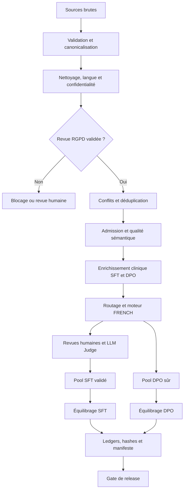

# Dossier technique — Pipeline de nettoyage, d’enrichissement et de sélection des données médicales

## 1. Objet du document

Ce document décrit la méthode que j’ai mise en place pour préparer mes datasets d’entraînement SFT et DPO destinés à un modèle de classification du niveau d’urgence médicale.

Je me base exclusivement sur le code présent dans le notebook `02_cleaning_pipeline`. Je ne reprends donc pas de résultat chiffré affiché lors d’une exécution et je n’ajoute pas de règle qui ne serait pas visible dans le code. Lorsque le notebook appelle un module interne sans montrer son implémentation, je décris uniquement son rôle observable, ses entrées, ses sorties et les contrôles effectués autour de cet appel.

Ma démarche suit une logique de réduction progressive du risque : une donnée ne peut atteindre le dataset final qu’après avoir franchi plusieurs contrôles indépendants portant sur la provenance, la structure, la confidentialité, la qualité sémantique, la cohérence clinique, le triage et la traçabilité.

## 2. Finalité de la pipeline

La pipeline prépare deux types de données :

- un dataset **SFT**, dans lequel chaque exemple reçoit une priorité de triage `P1`, `P2` ou `P3` ;
- un dataset **DPO**, composé d’un prompt, d’une réponse préférée `chosen`, d’une réponse rejetée `rejected` et d’une priorité clinique de référence.

L’échelle de sortie utilisée par le code est la suivante :

| Priorité | Interprétation |
|---|---|
| `P1` | Urgence majeure |
| `P2` | Urgence modérée |
| `P3` | Urgence différée |

Mon objectif n’est pas seulement de produire un volume de données suffisant. Je cherche surtout à construire un corpus :

- traçable jusqu’au fichier brut ;
- débarrassé des blocages de confidentialité ;
- dédupliqué ;
- validé sur le plan sémantique ;
- enrichi avec des informations médicales structurées ;
- associé au protocole FRENCH ;
- équilibré par priorité ;
- exporté sans modification silencieuse des textes sources.

## 3. Vue d’ensemble de l’architecture



La pipeline repose sur le principe du **fail-fast**. Lorsqu’un invariant important n’est pas respecté, le code lève une exception et interrompt la suite du traitement. Cette stratégie évite qu’un problème de structure, de confidentialité ou de traçabilité soit silencieusement propagé jusqu’au dataset final.

## 4. Organisation des données et des exécutions

### 4.1 Détection de la racine du projet

Le notebook détermine d’abord la racine du projet. S’il est lancé depuis le dossier `notebooks`, il remonte au dossier parent. La racine est ensuite ajoutée au `sys.path` uniquement si elle n’y figure pas déjà.

Cette organisation me permet d’exécuter le notebook depuis VS Code tout en important les modules du projet dans `scr`.

### 4.2 Répertoires principaux

Le code distingue plusieurs espaces :

| Répertoire | Rôle |
|---|---|
| `data/raw` | Sources brutes et protocole de triage |
| `data/audits_optimized` | Rapports produits par l’audit précédent |
| dossier `draft` du run | Fichiers intermédiaires et files de revue |
| `runs/<run_id>` | Artefacts, ledgers, rapports et manifeste d’un run |
| `data/processed/sft` | Datasets candidats ou publiés pour le SFT |
| `data/processed/dpo` | Datasets candidats pour le DPO |

Un identifiant temporel est créé pour isoler les artefacts d’une exécution. Le notebook produit également des identifiants fonctionnels `sft_run_id` et `dpo_run_id`, calculés à partir des empreintes des datasets, des ledgers, du protocole et de la seed.

## 5. Chargement, provenance et canonicalisation

### 5.1 Manifeste d’audit obligatoire

La préparation ne commence pas directement par la lecture des datasets. Le code exige la présence de `audit_manifest.json`, produit par le notebook d’audit précédent.

Ce manifeste doit au minimum contenir :

- `raw_row_counts` : nombre attendu de lignes par source ;
- `raw_file_hashes` : empreinte attendue des fichiers bruts.

Si le manifeste est absent, incomplet ou mal structuré, la pipeline s’arrête. Je m’assure ainsi que les données utilisées pour le nettoyage sont bien celles qui ont été auditées auparavant.

### 5.2 Validation de chaque source

Pour chaque entrée de `DATASET_SPECS`, le code :

1. construit le chemin du fichier brut ;
2. vérifie que ce fichier existe ;
3. le charge avec `load_raw` ;
4. appelle `validate_raw_dataset` avec la famille, le volume attendu et le hash attendu ;
5. conserve le DataFrame validé ;
6. canonicalise chaque ligne avec `Canonicalizer`.

La canonicalisation transforme les différentes sources dans un schéma interne commun. Le détail du mapping se trouve dans le module `scr.data.canonicalization`, qui n’est pas développé dans le notebook. Le notebook vérifie cependant que tous les identifiants canoniques sont uniques.

### 5.3 Choix méthodologique

J’ai choisi de séparer la validation brute et la canonicalisation. La validation protège la provenance du corpus, tandis que la canonicalisation rend les sources hétérogènes comparables pour les étapes suivantes.

## 6. Nettoyage et enrichissement initial

### 6.1 Rapport médical préalable

Le notebook charge `08_medical_details.json`. Chaque ligne doit contenir les champs suivants :

- `dataset` ;
- `id` ;
- `medical_marker_count` ;
- `medical_status` ;
- `triage_categories` ;
- `risk_categories` ;
- `sensitive_health_categories` ;
- `triage_marker_count` ;
- `risk_flag` ;
- `triage_status`.

Le code contrôle :

- que le rapport est une liste ;
- que chaque entrée possède tous les champs obligatoires ;
- que les identifiants sont uniques ;
- que la couverture des identifiants correspond exactement à celle des records canoniques.

Le fichier est lui-même ajouté à la table des empreintes d’audit.

### 6.2 Enrichissement de chaque record

Chaque observation est transmise à `RecordEnricher`, avec la ligne correspondante du rapport médical. D’après les appels et les contrôles qui suivent, cette étape orchestre au minimum :

- le nettoyage du contenu ;
- la détection de la langue ;
- l’ajout des signaux médicaux ;
- la détection et le traitement des PII avec Presidio ;
- le calcul de `clean_content_hash` ;
- la production des flags et des informations de confidentialité.

Je conserve un hash du contenu nettoyé pour relier les étapes ultérieures au texte exact qui a été traité. Ce hash devient un invariant de reprise pour l’extraction clinique.

### 6.3 Contrôles immédiats

Après enrichissement, le notebook refuse tout record sans `clean_content_hash`. Il isole également les observations portant les flags :

- `PII_REDACTION_FAILED` ;
- `PII_HUMAN_REVIEW` ;
- `PII_CANDIDATE`.

Le code produit des distributions par catégorie de masquage, catégorie de revue, dataset et split source. Les PII automatiques restantes sont affichées et restent bloquées.

## 7. Confidentialité et revue RGPD

### 7.1 Séparation des états

Les records sont répartis en plusieurs ensembles :

- records propres ;
- records bloqués ;
- candidats PII ;
- records nécessitant une revue humaine de confidentialité.

La fonction `unresolved(record)` centralise les signaux encore actifs. Un record ne peut être considéré propre que si cette fonction ne retourne aucun blocage.

### 7.2 File de revue de confidentialité

La file `privacy_review_queue.jsonl` contient les éléments nécessaires à une décision humaine :

- identifiant, dataset, split, famille et langue ;
- catégories et correspondances PII ;
- flags non résolus ;
- contenu textuel utile (`context`, `question`, `answer`, `choices`, `chosen`, `rejected`, `feedback`) ;
- hashes brut et nettoyé.

Avant l’écriture, le notebook vérifie que :

- tous les IDs existent ;
- aucun ID n’est dupliqué ;
- chaque ligne contient une catégorie PII, une correspondance et le flag `PII_HUMAN_REVIEW` ;
- le fichier relu est identique à l’objet validé en mémoire.

### 7.3 Application des décisions humaines

Les décisions sont chargées depuis `privacy_review_decisions.jsonl`. Le code impose une seule décision par ID et refuse les décisions extérieures à la file courante.

`PrivacyDecisionProcessor` applique ensuite chaque décision. Les statuts autorisés sont :

| Statut | Signification dans la pipeline |
|---|---|
| `PENDING` | La décision humaine manque encore |
| `APPROVED` | Le record peut poursuivre la pipeline |
| `EXCLUDED` | Le record doit être écarté |

`PrivacyReviewStatus` consolide enfin l’ensemble des décisions et vérifie l’absence de PII automatique résiduelle.

### 7.4 Gate de confidentialité

La variable `privacy_review_passed` constitue un verrou bloquant. Le code interdit l’analyse des conflits, la déduplication finale et la sélection tant que la revue RGPD n’est pas terminée.

Mon choix est donc de faire de la confidentialité un **prérequis de traitement**, et non un simple rapport informatif produit à la fin.

## 8. Analyse des conflits

Après validation RGPD, les IDs exclus sont retirés. Le code vérifie qu’aucun ID exclu ne reste dans le corpus et que la somme des records analysés et exclus correspond au volume initial.

`ConflictAnalyzer(conflict_records).analyze()` recherche ensuite les incohérences liées aux contenus QCM et aux préférences DPO. L’implémentation détaillée se trouve dans le module `scr.data.conflicts`; le notebook garantit surtout que l’analyse ne porte que sur des données ayant franchi le gate de confidentialité.

## 9. Déduplication exacte et quasi-déduplication

### 9.1 Groupes exacts

`DuplicateAnalyzer` construit d’abord les groupes de contenus identiques. La structure `union_find` sert à attribuer un `group_id` unique à chaque composante de doublons.

### 9.2 Quasi-doublons

Si `CONFIG.run_near_duplicates` est actif, la pipeline recherche également les relations de quasi-doublons puis les fusionne aux groupes existants.

Le code compare ensuite ces relations à celles du fichier historique `06_near_duplicates_details.json`. Cette comparaison distingue :

- les relations retrouvées dans les deux analyses ;
- celles présentes uniquement dans l’audit initial ;
- les nouvelles relations du run courant ;
- les relations historiques ignorées parce qu’un des records n’appartient plus au corpus RGPD validé.

### 9.3 Invariant d’admission

Tous les records candidats doivent posséder un `group_id`. À l’inverse, un record exclu ne doit pas en recevoir.

Au moment de l’admission, le code impose également qu’un seul représentant de chaque groupe soit retenu. Ce choix limite la mémorisation de formulations répétées et le poids artificiel de certains cas.

## 10. Admission des données

`AdmissionSelector(records).select()` produit le premier pool admissible. Le notebook valide ensuite plusieurs invariants :

- IDs présents et uniques ;
- absence de statut RGPD `PENDING` ou `EXCLUDED` ;
- absence de flags RGPD bloquants ;
- absence de signal non résolu ;
- présence d’un `group_id` ;
- unicité des groupes ;
- statut final égal à `ELIGIBLE`.

À ce stade, une observation est techniquement admissible, mais elle n’est pas encore considérée comme sémantiquement correcte ni cliniquement exploitable.

## 11. Validation sémantique

### 11.1 Contrôle déterministe

Chaque record admissible est évalué par `SemanticQualityValidator`. Trois verdicts sont possibles :

- `PASS` ;
- `REVIEW` ;
- `FAIL`.

Les `FAIL` sont écartés du périmètre. Les `PASS` rejoignent directement les pools sources. Les `REVIEW` sont conservés dans un périmètre séparé pour un second avis.

Le rapport sémantique agrège les volumes et le score moyen de qualité par dataset, famille, langue et verdict.

### 11.2 Séparation SFT et DPO

Les records `PASS` sont divisés en deux branches :

- famille différente de `dpo` : branche SFT ;
- famille `dpo` : branche DPO.

`SFTSourcePoolBuilder` construit le pool SFT. Les records DPO reçoivent `training_type = "dpo"`.

Le code vérifie ensuite :

- l’unicité des IDs ;
- la confidentialité ;
- l’absence de signal non résolu ;
- le verdict `PASS` ;
- la présence de `chosen` et `rejected` ;
- la différence entre `chosen` et `rejected` ;
- la disjonction des pools SFT et DPO ;
- l’unicité des groupes de doublons.

### 11.3 Second avis sémantique optionnel

Le juge sémantique n’est chargé que si `CONFIG.mode_llm` et `CONFIG.run_llm_judge` sont actifs. Le nombre de records est limité par `CONFIG.llm_batch_size`.

Le tokenizer et le modèle sont chargés avec :

- une révision fixée par `JudgeConfig.REVISION` ;
- `local_files_only=True` ;
- `trust_remote_code=False` ;
- un `chat_template` obligatoire ;
- `device_map="auto"` ;
- passage du modèle en mode évaluation.

Ce choix limite les dépendances réseau pendant l’exécution et évite l’exécution de code distant fourni par le dépôt du modèle.

### 11.4 Revue humaine sémantique

Les `REVIEW` SFT et DPO sont exportés dans deux files séparées. Les décisions humaines sont ensuite chargées, contrôlées et appliquées.

Le contrat final interdit explicitement :

- de modifier un `PASS` déterministe sans décision humaine ;
- de promouvoir un `REVIEW` en `PASS` sans décision humaine ;
- d’ignorer un verdict humain disponible.

Les pools sémantiques finaux ne conservent que les records dont le verdict final est `PASS`.

## 12. Préparation du protocole de triage

### 12.1 Chargement de FRENCH

Le protocole est chargé depuis `data/raw/triage_protocol.json`. Le notebook en extrait notamment le mapping `french_to_target` reliant les niveaux FRENCH aux priorités cibles.

Trois objets principaux sont initialisés :

- `AutomaticTriageDecisionEngine` pour les décisions déterministes ;
- le lexique bilingue des motifs FRENCH ;
- `GeneralMedicalExtractor` pour l’extraction clinique.

### 12.2 Validation de la couverture

Le code vérifie une correspondance exacte entre les `rule_id` du protocole et ceux du lexique :

- aucun motif du protocole ne doit manquer ;
- aucun motif inconnu ne doit être ajouté ;
- chaque motif doit posséder une clé `knowledge_reference`.

Cette vérification garantit que l’extracteur et le moteur raisonnent sur la même version du protocole.

## 13. Enrichissement clinique SFT

### 13.1 Sélection du périmètre

La branche SFT conserve les records validés sémantiquement dont la famille appartient à `TriagePoolConfig.FAMILIES`.

### 13.2 Extraction et reprise

Les résultats sont enregistrés dans `1_triage_clinical_extracted.jsonl`. Une extraction existante n’est réutilisée que si :

- le record source possède un `clean_content_hash` ;
- le hash enregistré sur le résultat correspond au hash source ;
- `medical_extraction.source_clean_content_hash` correspond également au hash source.

Les records non valides ou absents sont retraités. Un checkpoint est écrit toutes les 500 observations. À la fin, l’ordre des sources est restauré et toutes les correspondances de hash sont revérifiées.

### 13.3 Structures vérifiées

Chaque résultat doit contenir trois dictionnaires :

- `patient` ;
- `medical_knowledge` ;
- `medical_extraction`.

Le code contrôle aussi que tous les motifs extraits appartiennent au lexique FRENCH.

L’audit de l’extraction mesure séparément :

- la présence de données patient ;
- la présence de connaissance médicale ;
- la disponibilité d’une réponse correcte ;
- la détection d’un motif FRENCH ;
- les conflits de signes critiques ;
- les conflits de concepts ;
- les champs patient et connaissance les plus souvent extraits.

## 14. Enrichissement clinique DPO

### 14.1 Extraction par branche

Pour une paire DPO, le code extrait séparément :

- le `prompt` ;
- la réponse `chosen` ;
- la réponse `rejected`.

Si le champ `prompt` n’est pas présent, la question sert de fallback. Chaque branche est présentée à l’extracteur comme une source autonome, sans modifier le record initial.

Le checkpoint `2_dpo_clinical_extracted.jsonl` est validé à partir du hash source et de l’égalité entre le texte extrait et le texte réel de chaque branche.

### 14.2 Consolidation de la paire

La représentation clinique finale d’une paire suit une règle explicite :

- les informations patient proviennent du `prompt` ;
- la connaissance médicale est fusionnée depuis `prompt + chosen` ;
- `rejected` reste disponible pour l’audit et la traçabilité, mais n’enrichit pas la connaissance de référence.

La fusion concerne les symptômes, conditions, complications, examens, résultats biologiques et d’imagerie, facteurs de risque, traitements, médicaments, procédures, pathogènes et éléments anatomiques.

Les valeurs sont dédupliquées tout en conservant l’ordre d’apparition. Les motifs FRENCH sont dédupliqués par `rule_id`.

Ce choix évite que le contenu explicitement rejeté soit utilisé comme vérité médicale pour attribuer la priorité de la paire.

## 15. Routage TRIAGE

Le routage est effectué séparément pour les branches SFT et DPO :

- `1_triage_clinical_extracted.jsonl` vers `4_triage_routing.jsonl` ;
- `3_dpo_pair_triage_source.jsonl` vers `5_dpo_triage_routing.jsonl`.

Après routage, le code vérifie qu’une route existe pour chaque record source. Un audit dédié contrôle les volumes, les hashes et le protocole. Si le rapport d’audit n’est pas valide, la pipeline s’arrête.

Les routes transmises automatiquement au moteur sont :

- `protocol_annotation` ;
- `controlled_synthesis`.

Les routes `human_review` sont traitées dans une file séparée.

## 16. Décision automatique de triage

Le même `AutomaticTriageDecisionEngine` est appliqué aux flux SFT et DPO, mais les décisions et les fichiers restent séparés.

Le moteur peut produire des décisions définitives ou des situations nécessitant une revue. Le notebook traite notamment les méthodes :

- `knowledge_reference` ;
- `knowledge_priority_conflict` ;
- `knowledge_common_priority_review` ;
- `knowledge_full_convergence_review` ;
- méthodes déterministes et règles exactes pour les cas DPO sûrs.

Les conflits de priorité ou les convergences non définitives avec `priority=None` sont dirigés vers la revue.

## 17. Revues humaines de triage

### 17.1 Revue du routage

Les records dont la route est `human_review` sont exportés avec :

- les preuves cliniques complètes ;
- la route et sa justification ;
- la priorité courante ;
- les motifs patient et connaissance.

Les décisions autorisées sont `approve`, `reject` ou `review`. Une décision `approve` doit comporter une priorité `1`, `2` ou `3`.

### 17.2 Revue du protocole

Les décisions moteur fondées sur une connaissance FRENCH mais encore ambiguës sont placées dans `8_protocol_review_queue.jsonl`.

Une décision humaine approuvée remplace la priorité du moteur et reçoit la méthode `protocol_review`. La confiance est convertie en score :

- `1.0` pour une confiance `high` ;
- `0.7` dans les autres cas.

Les records approuvés lors de la revue du routage sont ajoutés avec la méthode `routing_review` et un score de confiance de `1.0`.

Le code vérifie qu’une seule décision finale existe par ID.

## 18. LLM Judge clinique

### 18.1 Périmètre

Le LLM Judge ne reçoit pas tous les records. Il est réservé aux conflits protocole restés sans décision après le moteur et la première revue.

Les méthodes autorisées pour ce juge sont :

- `knowledge_priority_conflict` ;
- `knowledge_common_priority_review` ;
- `knowledge_full_convergence_review`.

Les cas déjà résolus et les candidats du juge doivent former deux ensembles disjoints.

### 18.2 Modèle et exécution

Le code utilise :

- le modèle local `gemma3:4b` ;
- l’API locale Ollama `http://localhost:11434/api/chat` ;
- une température égale à `0` ;
- une réponse imposée au format JSON ;
- un timeout de 180 secondes ;
- trois tentatives maximum ;
- un backoff exponentiel de 1 puis 2 secondes avant la dernière tentative.

Les résultats et les erreurs sont persistés séparément, ce qui permet de reprendre l’exécution sans rejuger les IDs déjà traités.

### 18.3 Preuves transmises

Le prompt candidat conserve uniquement les informations utiles :

- texte source : contexte et question ;
- réponse de référence ;
- informations patient non vides ;
- connaissance médicale non vide ;
- priorités candidates ;
- niveaux FRENCH candidats ;
- méthode de décision ;
- règles et critères FRENCH associés.

Cette compaction réduit la taille du prompt tout en maintenant les éléments nécessaires à l’arbitrage.

### 18.4 Règles du juge

Le prompt système demande au modèle de :

1. déterminer si le texte décrit réellement une situation patient ;
2. utiliser d’abord les preuves explicites du texte source ;
3. rechercher les critères `P1`, puis `P2`, puis `P3` ;
4. utiliser FRENCH comme cadre de décision ;
5. ne pas inventer de symptôme ou de complication ;
6. ne pas attribuer `P1` uniquement parce qu’il figure parmi les priorités candidates ;
7. retourner `approve`, `review` ou `reject` avec une justification courte.

Dans cette version du code, une définition théorique ou une description générale de maladie n’est pas considérée automatiquement comme un cas patient. Le texte source reste la preuve principale et le nom d’une pathologie ne suffit pas, à lui seul, à démontrer sa gravité actuelle.

### 18.5 Normalisation et garde-fous

La sortie est validée avec Pydantic. Le score est borné entre `0` et `1`. La priorité est limitée à `1`, `2`, `3` ou `None`.

Une décision `approve` n’est conservée que si :

- la source décrit un cas patient ;
- les preuves sont suffisantes ;
- le motif est soutenu ;
- l’interprétation est cohérente avec le protocole ;
- la priorité est soutenue ;
- la priorité est valide.

Sinon, la décision est ramenée à `review`. Si `source_is_patient_case` est faux, elle devient `reject`.

Pour être directement éligible au SFT, un jugement doit être `approve`, posséder une priorité valide, satisfaire les cinq contrôles booléens et atteindre une confiance d’au moins `0.75`.

### 18.6 Revue post-LLM

Les décisions non directement éligibles et non rejetées avec forte confiance sont dirigées vers `13_llm_judge_human_review_queue.jsonl`.

Les décisions humaines finales sont appliquées depuis `14_llm_judge_human_review_decisions.jsonl`. La fusion finale distingue trois sources de validation :

- décision validée avant le Judge ;
- `llm_judge` ;
- `human_review_after_llm`.

Le code interdit qu’un même ID soit validé par plusieurs voies.

## 19. Construction du pool SFT validé

Le fichier `15_triage_validated_pool.jsonl` réunit les records cliniques complets et leur décision finale.

Chaque ligne conserve :

- le record enrichi ;
- la décision de triage ;
- le résultat éventuel du LLM Judge ;
- la décision humaine éventuelle après le Judge ;
- la source de validation.

Un ID absent de la source clinique ou une priorité différente de `1`, `2` ou `3` empêche son ajout. Les doublons d’ID et les pertes silencieuses sont explicitement refusés.

## 20. Contrôles spécifiques aux préférences DPO

### 20.1 Qualité lexicale

Pour chaque paire, le notebook calcule :

- présence du prompt ;
- présence de `chosen` ;
- présence de `rejected` ;
- égalité exacte des deux réponses ;
- similarité de Jaccard sur les tokens ;
- longueur de chaque réponse ;
- ratio entre la réponse la plus longue et la plus courte ;
- indicateur `chosen_longer`.

Cette étape est un audit : elle n’applique pas encore de filtre.

### 20.2 Comparaison médicale

Le code compare ensuite les informations médicales extraites dans `chosen` et `rejected` :

- éléments partagés ;
- éléments propres à chaque réponse ;
- motifs FRENCH de chaque branche ;
- correspondance avec les règles de référence ;
- relation `chosen_richer`, `rejected_richer` ou `balanced`.

Cette analyse reste également descriptive dans le notebook.

### 20.3 Pool DPO sûr

La sélection stricte du pool DPO conserve :

- une priorité déjà attribuée par le moteur ; ou
- une seule priorité candidate valide.

Les cas à plusieurs priorités non résolues sont écartés de ce pool. Les paires vides ou identiques sont interdites.

## 21. Équilibrage et choix final

### 21.1 Stratégie SFT

Le notebook regroupe les records selon les six combinaisons `langue × priorité` :

- français `P1`, `P2`, `P3` ;
- anglais `P1`, `P2`, `P3`.

Pour garantir le même nombre d’exemples par priorité, le code calcule le volume disponible pour chaque priorité puis retient le minimum des trois. La taille finale est donc :

```text
target_total = min(volume_P1, volume_P2, volume_P3) × 3
```

Dans chaque priorité, le code vise d’abord une répartition moitié français, moitié anglais. Si une langue ne possède pas assez d’exemples, le reliquat est complété avec l’autre langue.

Les records sont triés par ID avant sélection. La procédure est donc déterministe, mais elle ne réalise pas de tirage aléatoire.

### 21.2 Stratégie DPO

Le DPO final contient le même volume de `P1`, `P2` et `P3`, sans sur-échantillonnage. Le volume par priorité correspond au plus petit pool disponible.

Dans chaque priorité, l’ordre de choix est :

1. priorités validées directement par le moteur ;
2. priorités issues d’un candidat unique ;
3. ratio de longueur `chosen/rejected` le plus proche de `1` ;
4. ID pour stabiliser l’ordre.

Cette stratégie favorise les labels les plus directement justifiés et limite le biais évident lié à une différence excessive de longueur entre les deux réponses.

## 22. Formats d’entraînement produits

### 22.1 Format SFT

Le fichier `21_sft_training_dataset.jsonl` contient :

```json
{
  "id": "...",
  "language": "fr|en",
  "source_split": "...",
  "question": "...",
  "context": "...",
  "answer": "...",
  "priority": 1
}
```

Le code vérifie que `question`, `context` et `answer` sont strictement identiques aux textes sources, après conversion en chaîne et suppression des espaces externes. Aucun résumé, aucune troncature et aucune reformulation ne sont appliqués.

### 22.2 Format DPO

Le fichier `21_dpo_training_dataset.jsonl` contient :

```json
{
  "id": "...",
  "language": "fr|en",
  "source_split": "...",
  "prompt": "contexte puis question",
  "chosen": "...",
  "rejected": "...",
  "priority": 2
}
```

Le prompt est construit en concaténant le contexte et la question avec une ligne vide lorsqu’ils sont tous les deux présents. Les textes `chosen` et `rejected` sont conservés intégralement. Le code interdit les champs vides et les deux réponses identiques.

## 23. Traçabilité et reproductibilité

### 23.1 Ledgers

Le ledger SFT conserve, sans recopier le contenu clinique :

- l’ID ;
- la langue ;
- le dataset, la source et le split ;
- la famille ;
- la priorité et sa provenance ;
- la source de validation ;
- la méthode de décision ;
- la confiance ;
- les hashes brut et nettoyé.

Le ledger DPO conserve :

- l’ID et la langue ;
- la priorité ;
- le mode de validation de la priorité ;
- la méthode de décision ;
- la présence et la distinction des préférences.

Le code vérifie que les IDs des ledgers correspondent exactement aux IDs des datasets.

### 23.2 Empreintes et identités de run

Les fichiers SFT et DPO reçoivent une empreinte SHA-256. Le protocole est également hashé.

L’identité d’un run combine :

- hash du dataset ;
- digest du ledger ;
- hash du protocole ;
- seed de configuration.

Le manifeste conserve les volumes, langues, priorités, méthodes, validations, statuts, paramètres de déduplication et limitations connues.

### 23.3 Écritures protégées

Les fonctions `same_or_write_jsonl` et `same_or_write_json` appliquent une règle d’immutabilité :

- si l’artefact n’existe pas, il est écrit ;
- s’il existe avec le même digest, il est réutilisé ;
- s’il existe avec un contenu différent, une erreur impose la création d’un nouveau run.

Cette protection empêche de remplacer silencieusement un dataset ou un rapport appartenant à un run déjà identifié.

### 23.4 Archivage du protocole

Le protocole utilisé est copié dans le répertoire du run. Le code compare ensuite les empreintes du fichier source et de la copie. Une divergence invalide la reproductibilité.

## 24. Gates de validation

La logique générale repose sur plusieurs gates successifs :

| Gate | Condition principale |
|---|---|
| Provenance | Volumes et hashes conformes au manifeste d’audit |
| Confidentialité | Revue RGPD terminée, aucune PII automatique bloquante |
| Admission | Aucun flag non résolu, IDs et groupes uniques |
| Sémantique | Verdict final `PASS` |
| Extraction | Hash source identique au hash de l’extraction |
| Routage | Une route par record, audit TRIAGE valide |
| Triage | Priorité finale dans `{1, 2, 3}` |
| DPO | `chosen` et `rejected` présents et distincts |
| Structure | Langues, IDs et priorités conformes |
| Traçabilité | Dataset, ledger, manifeste et protocole cohérents |
| Release | Contrôles automatiques et approbation humaine valides |

Le code prévoit une approbation humaine de release comportant cinq validations explicites :

- droits d’usage ;
- revue de confidentialité ;
- revue clinique ;
- revue qualité ;
- acceptation des limites de la pipeline.

L’approbation doit viser le bon `run_id`, le SHA-256 exact du dataset, un reviewer identifié et une date ISO-8601 valide.

## 25. Principaux artefacts produits

| Fichier | Rôle |
|---|---|
| `privacy_review_queue.jsonl` | Cas nécessitant une revue RGPD |
| `privacy_review_decisions.jsonl` | Décisions humaines RGPD |
| `semantic_review_queue.jsonl` | Revue sémantique SFT |
| `dpo_semantic_review_queue.jsonl` | Revue sémantique DPO |
| `1_triage_clinical_extracted.jsonl` | Extraction clinique SFT |
| `2_dpo_clinical_extracted.jsonl` | Extraction des trois branches DPO |
| `3_dpo_pair_triage_source.jsonl` | Consolidation clinique DPO |
| `4_triage_routing.jsonl` | Routage SFT |
| `5_dpo_triage_routing.jsonl` | Routage DPO |
| `6_triage_protocol_decisions.jsonl` | Décisions moteur SFT |
| `7_dpo_triage_protocol_decisions.jsonl` | Décisions moteur DPO |
| `8_routing_human_review_queue.jsonl` | Revue du routage SFT |
| `8_protocol_review_queue.jsonl` | Revue des conflits protocole SFT |
| `9_routing_human_review_decisions.jsonl` | Décisions humaines de routage |
| `9_protocol_review_decisions.jsonl` | Décisions humaines protocole |
| `10_dpo_triage_reference_pool.jsonl` | Statut de référence FRENCH DPO |
| `11_llm_judge_candidates.jsonl` | Candidats au LLM Judge |
| `12_llm_judge_audit.jsonl` | Résultats du Judge |
| `12_llm_judge_errors.jsonl` | Erreurs techniques rejouables |
| `13_llm_judge_human_review_queue.jsonl` | Revue humaine post-Judge |
| `14_llm_judge_human_review_decisions.jsonl` | Décisions humaines finales |
| `15_triage_validated_pool.jsonl` | Pool SFT cliniquement validé |
| `16_dpo_deterministic_quality.jsonl` | Audit lexical DPO |
| `17_dpo_medical_preference.jsonl` | Audit médical chosen/rejected |
| `19_dpo_safe_pool.jsonl` | Paires DPO à priorité non ambiguë |
| `20_sft_final_balanced.jsonl` | SFT équilibré |
| `20_dpo_final_balanced.jsonl` | DPO équilibré |
| `21_sft_training_dataset.jsonl` | Format d’entraînement SFT |
| `21_dpo_training_dataset.jsonl` | Format d’entraînement DPO |
| `sft_ledger.jsonl` / `dpo_ledger.jsonl` | Traçabilité des datasets |
| `run_manifest.json` | Carte d’identité technique du run |

## 26. Choix techniques structurants

| Choix | Justification observable dans le code |
|---|---|
| Validation par hashes | Empêcher l’utilisation ou la reprise d’un contenu différent de celui audité |
| Confidentialité avant sélection | Interdire qu’une donnée bloquée progresse dans la pipeline |
| Un seul record par groupe de doublons | Réduire la redondance du corpus |
| Trois niveaux sémantiques | Distinguer acceptation, rejet et besoin d’arbitrage |
| LLM local optionnel | Apporter un second avis sans dépendre obligatoirement d’un service externe |
| Décision humaine prioritaire | Empêcher une promotion automatique d’un cas ambigu |
| Extraction DPO par branche | Comparer la preuve du prompt et le contenu des deux réponses |
| Knowledge DPO = prompt + chosen | Ne pas utiliser la réponse rejetée comme référence médicale |
| Judge limité aux conflits | Réserver le coût du modèle aux cas non résolus |
| Température nulle | Favoriser la stabilité des décisions du Judge |
| Seuil de confiance `0.75` | Ne retenir automatiquement que les décisions fortes |
| Équilibrage sans sur-échantillonnage | Ne pas dupliquer artificiellement les classes minoritaires |
| Sélection déterministe par ID | Rendre la sélection reproductible |
| Écritures immuables par run | Interdire l’écrasement silencieux d’un artefact |
| Approbation humaine de release | Ne pas confondre réussite technique et validation finale |

## 27. Limites déclarées dans le code

Le manifeste énumère explicitement plusieurs limites :

- la détection des quasi-doublons est approximative ;
- certains paraphrases sémantiques ou multilingues peuvent ne pas être détectés ;
- les scénarios bilingues équivalents doivent rester dans la même partition ;
- la détection automatique des PII ne constitue pas une garantie RGPD exhaustive ;
- les validations cliniques automatiques ne remplacent pas une validation indépendante par un professionnel de santé ;
- la pipeline ne peut pas déterminer si un contenu équivalent figurait déjà dans le préentraînement du modèle.

Les splits sont seulement décrits dans le manifeste avec une stratégie par groupes. Ils ne sont pas créés dans ce notebook.

## 28. Points de cohérence à corriger dans le notebook

Cette section ne remet pas en cause la méthode générale. Elle recense les écarts visibles directement dans le code fourni.

### 28.1 Arrêt explicite avant les cellules de release

Une cellule contient uniquement `stopici`. Si le notebook est exécuté séquentiellement, cette instruction provoque une erreur avant les cellules de validation finale et de release. La partie située après cette cellule apparaît donc comme une section de travail non intégrée au flux exécutable principal.

### 28.2 Deux contrats SFT différents

Le SFT produit par `build_sft_record` contient :

- `id` ;
- `language` ;
- `source_split` ;
- `question` ;
- `context` ;
- `answer` ;
- `priority`.

En revanche, `SFTReleaseValidator` attend un autre format :

- trois messages `system`, `user`, `assistant` ;
- une réponse assistant JSON ;
- un bloc `metadata` ;
- `rule_id`, `french_level`, `priority` et `clinical_pair_id`.

La release ne valide donc pas directement le format SFT construit plus haut. Il faut choisir un contrat final unique ou ajouter une étape explicite de conversion avant le gate de release.

### 28.3 Variables non définies dans la section finale

Les cellules postérieures à `stopici` utilisent notamment :

- `validation_report` ;
- `pair_languages` ;
- `run_id`.

Aucune affectation de ces variables n’apparaît dans le code du notebook fourni. Leur utilisation empêche l’exécution autonome de cette section.

### 28.4 Contrat du rapport de confidentialité

Le `privacy_report` construit dans la partie d’archivage contient `method`, `handled_upstream` et `datasets`, mais pas de champ `status`. La section de release teste pourtant `privacy_report["status"] == "PASS"` ou `privacy_report.get("status") == "PASS"`.

Le rapport et le gate doivent partager le même schéma.

### 28.5 Contrat du profil DPO

Le DPO final utilise principalement :

- `dpo_pair.chosen` et `dpo_pair.rejected` ;
- `dpo_final_priority` ;
- `dpo_priority_validation` ;
- `triage_engine_decision`.

Une version du `DPOProfiler` lit cependant `chosen` et `rejected` à la racine ainsi qu’un bloc `dpo_priority`. Ce profil peut donc retourner des valeurs `UNKNOWN` ou des compteurs erronés avec le format réellement construit dans les cellules précédentes.

### 28.6 Identité DPO redéfinie après calcul du run ID

`dpo_run_identity` est d’abord utilisé pour produire `dpo_run_id`, puis redéfini avec `parent_sft_run_id`. Le `dpo_run_id` n’est pas recalculé après cette seconde définition. Le lien de parenté avec le SFT n’influence donc pas l’identifiant DPO actuel.

### 28.7 Plusieurs identifiants temporels et réaffectation de `RUN_DIR`

Le notebook crée d’abord `RUN_ID` via `OutputConfig`, puis `data_run_id` pour l’archivage, et utilise ensuite `run_id` dans la release. `RUN_DIR` est également réaffecté.

Je dois unifier ces identifiants afin qu’un même run logique ne soit pas réparti entre plusieurs arborescences ou référencé sous plusieurs noms.

### 28.8 Volume SFT final

La sélection équilibrée calcule le plus grand volume commun aux trois priorités. Elle ne limite pas explicitement la sortie à `CONFIG.sft_target` et ne garantit donc pas à elle seule un total précis, par exemple 5 000 lignes.

À l’inverse, la section de release exige `len(records) == CONFIG.sft_target` et 2 500 paires bilingues. Ces deux stratégies ne correspondent pas au même contrat de sélection.

### 28.9 Sélection stable mais non aléatoire

La sélection SFT prend les premiers records après tri par ID. Cette méthode est reproductible, mais le code ne vérifie pas que l’ordre des IDs est indépendant de la source, du split ou d’une autre caractéristique. Un échantillonnage déterministe basé sur `CONFIG.seed` permettrait de conserver la reproductibilité tout en réduisant ce risque de biais d’ordre.

## 29. Synthèse de ma méthode

Ma pipeline applique une succession de filtres et de preuves plutôt qu’un nettoyage unique :

1. je vérifie l’identité des fichiers bruts avec le manifeste d’audit ;
2. je canonicalise les sources dans un schéma commun ;
3. je nettoie et enrichis les textes tout en calculant une empreinte ;
4. je bloque les PII et impose une revue humaine lorsque l’automatisation ne suffit pas ;
5. je détecte les conflits et les groupes de doublons ;
6. je n’admets qu’un record propre par groupe ;
7. je valide la qualité sémantique avec un contrôle déterministe, un second avis optionnel et une revue humaine ;
8. j’extrais séparément les informations patient et la connaissance médicale ;
9. je rattache les records au protocole FRENCH ;
10. je route les cas vers le moteur, la revue humaine ou le LLM Judge ;
11. je fusionne uniquement les décisions possédant une priorité défendable ;
12. je construis des pools SFT et DPO équilibrés sans sur-échantillonnage ;
13. je conserve les textes sources sans reformulation ;
14. je produis des ledgers, hashes, rapports et manifestes ;
15. je protège la release par des gates automatiques et une approbation humaine.

Cette architecture rend les décisions vérifiables et permet de localiser précisément la raison pour laquelle une observation est acceptée, revue, bloquée ou exclue. Le principal travail restant consiste à harmoniser le contrat des dernières cellules de release avec les formats SFT et DPO réellement produits dans le corps de la pipeline.
